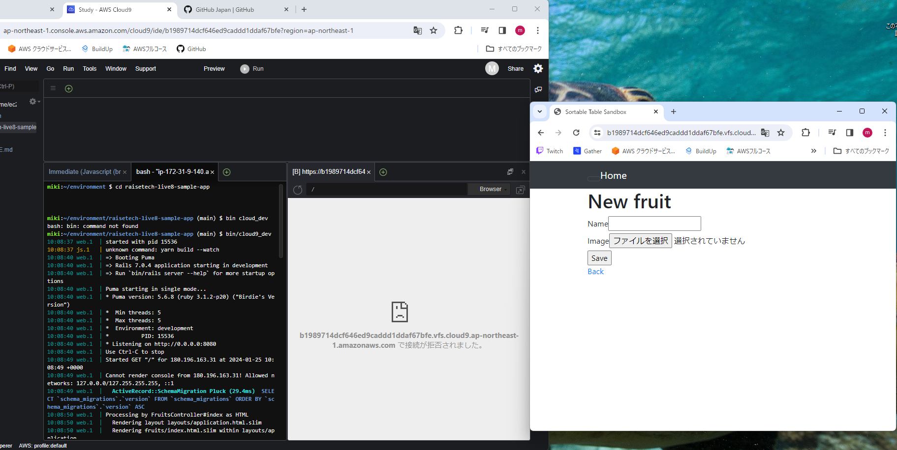
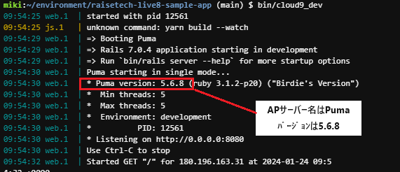
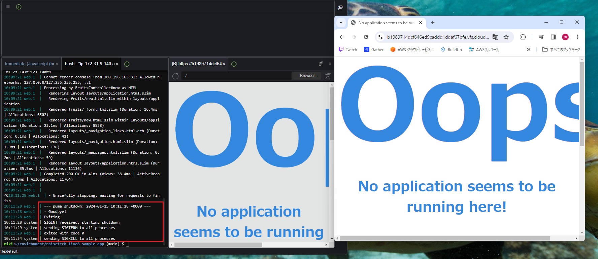
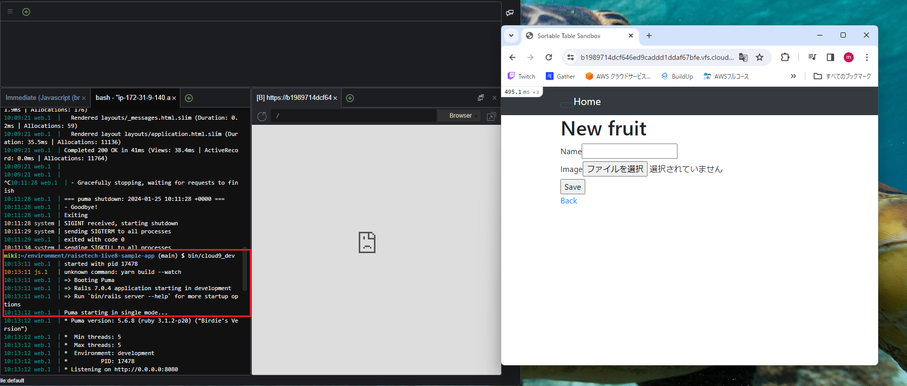
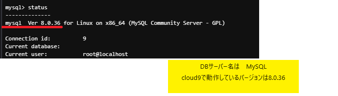
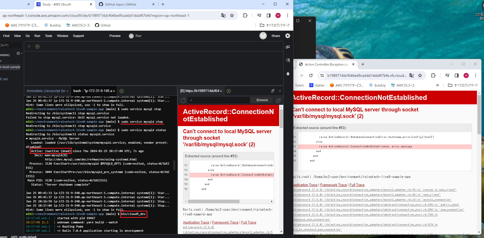

# 第3回課題
### ＜感じた事＞
とても難解でした。３回目の課題は最初の関門と聞いて 
とても納得です。 

### ＜学んだ事＞
現在の対象の状態を確認しながら作業することが大事だと感じました。 
対象の状態を確認し、変更を行い、また現在の状態を確認し変更がきちんと 
行われているか何度も繰り返して確認することでミスを防止できる。 
特にMySQLを停止した後の表記をエラーと思ってしまい 
かなり混乱してしまいました。ステータスを確認したら問題なかったと 
確認できましたが・・・ 
今まであまりそのような習慣がなかったので癖付けたいと思います。 

以下、課題のエビデンスです。 
 
1.サンプルアプリケーションのデプロイ成功&ブラウザでアクセス完了 
 

2.APサーバー名とバージョン 
 

3.APサーバー停止後はアクセス不可となっている 
 

4.APサーバーに再接続し、サンプルアプリケーションの再起動確認 
 

5.DBサーバー名とバージョン 
 

6.DBサーバー停止後にアクセス不可となることを確認 
 

7.Railsの構成管理ツールの名前は何でしたか？ 
**「Bundler」**です！ 

以上です。よろしくお願いいたします。
