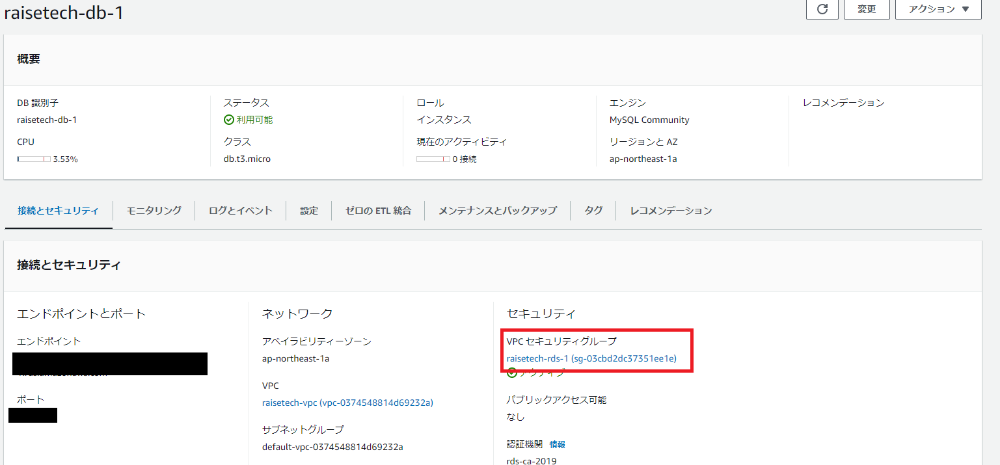

# 第4回課題提出
### エビデンス画像
1.AWS上に新しくVPCを作成 
 

2.EC2を構築 
 

3.RDSを構築 
 

4.EC2からRDSに接続し、正常であることを確認 
 

#### 今回行った事
講義資料を見ながらVPC、EC2インスタンス、RDSを作成。 
EC2、RDSのVPCは新たに作成したVPCを指定。以前の課題で作成したcloud9のVPCがデフォルト設定になっていたので間違えないように注意した。 
EC2に接続する方法を検索するとWindowsではTeraTermがメジャーとのことだったのでそちらを選択。 
接続するとERROR 2003 (HY000): Can’t connect to MySQL server(110)のエラーが出てしまう。調べるとセキュリティ設定が誤っていると予想 
されたのでRDS側のセキュリティグループを確認。プロトコルとポート番号が間違っていたのでTCP、3306に修正すると問題なく接続できた。 
 
以上です。ご確認の程よろしくお願いいたします。