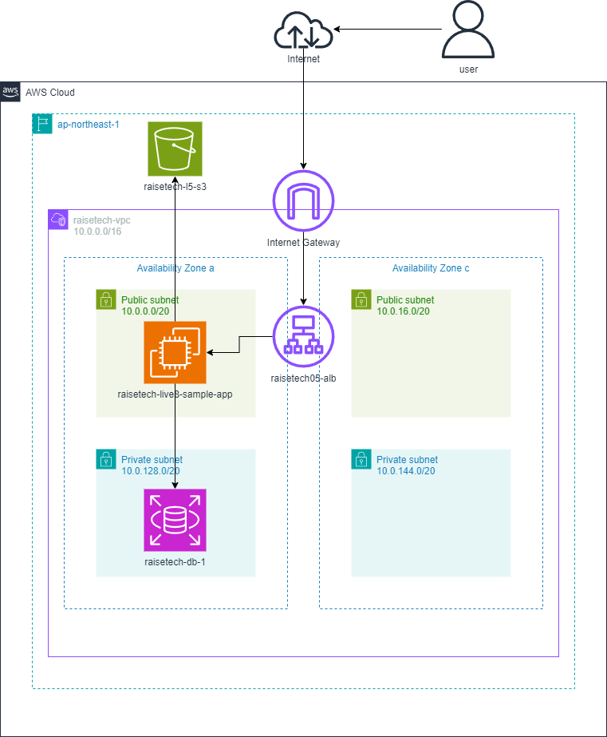

# 第5回課題
#### 課題内容
- EC2上でサンプルサプリケーションをデプロイ
- ELB（ALB）の追加
- S3の追加（サンプルアプリケーションの画像保存先として使用）

EC2インスタンス名：raisetech-live8-sample-app 
ALB名：raisetech05-alb 
S3名：raisetech-l5-s3 

---

## EC2上でサンプルサプリケーションをデプロイ
- 組み込みサーバーだけでデプロイ 

- unicornを使ってデプロイ 

- Nginxの単体起動確認 

- Nginxとunicornを組み合わせてデプロイ 

---

## ELB（ALB）の追加
- ALBの作成 

- ターゲットグループのヘルスステータス 

- ALBのDNS名でアクセスし動作確認完了 

---
## S3の追加（サンプルアプリの画像保存先として使用）
- S3の作成 

- EC2にS3への接続を許可するIAMロール追加 

- IAMロールの内容（AmazonS3FullAcces付与） 

- S3に画像を保存 

- S3内に画像がある事を確認（分かりやすいよう名称を01～03へ変更しました） 

---
## 構成図の作成

---
#### 以下、学習記録として記述しました。課題とされた内容ではありません。
---
### どのように本課題を実施したか
1. 第3回で実施したサンプルアプリケーションのデプロイ手順はすべてメモしていたので、その手順を行うために必要な機能のインストールをまず行った。ただ、余計な機能などをインストールする可能性があったので、まずは今回の課題で実施すべき内容の全体像をある程度把握してから情報の選定を行い、実際の作業に移った。 

2. 環境構築が完了し、Puma、unicorn、Nginx、Neginx＋unicornの順番に接続設定を変更＆サンプルアプリケーションの動作確認を繰り返し実行した。第3回のライブコーディングにて接続先などの設定は特定のファイルに記述されており、その内容を変更することで設定を変更していくとわかったので、それぞれの設定に必要なファイル名を検索し必要な設定内容をノートにまとめて整理しながら進めるようにした。 

3. ALB、S3についてもgoogle検索の結果表示されたサイトの作成方法にしたがって進めたが、これまでの工程よりも比較的エラーがなく、スムーズに実行できた。

---
### 今回の課題でつまったポイント（数えきれないほどあるがまとめてみた）
- ファイル内容の記述ミス
- 接続設定の変更ミス
- ホストブロックエラー
- 実行userの統一ができていなかった
- 新しい用語と機能の理解 
いずれもgoogle検索と過去の質問相談所の内容を確認し解決できたが、理解して解決したというよりも、試してみたら解決できた、というのが正しい。どんどん課題をこなして、きちんと理解してエラーを解決できたと言えるようになりたい。