# 第5回課題_02

## 課題内容（サンプルアプリケーションがunicorn+nginxでの起動から、puma+nginxでの起動に変更された）

- EC2 上にサンプルアプリケーションをデプロイして、動作させてください。
  - サンプルは第3回で案内済みのものを使ってください。
  - まずは組み込みサーバーだけで、動作したらサーバーアプリケーションを分けて動くかチャレンジしてみましょう。必要な知識や手順は授業の中でお伝えしています。
- 動作したら、ELB(ALB)を追加してみましょう。
- ELB を加えて動作が確認できたら、さらに S3 を追加してみましょう。S3 をどのように使うかはお任せします。
- ここまでが問題無く動作したら、その環境を構成図に書き起こしてください。
  - 構成図の書き方動画をポータルサイトに公開しています。
- 以上の結果を、正しく動作したことを示す資料（画像など）を添えて報告してください。

---

## EC2上でサンプルサプリケーションをデプロイ

- bin/devで実行<br>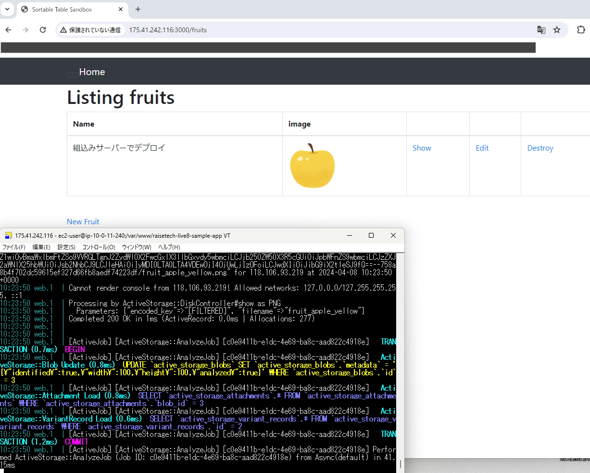
- pumaをsystemdで起動<br>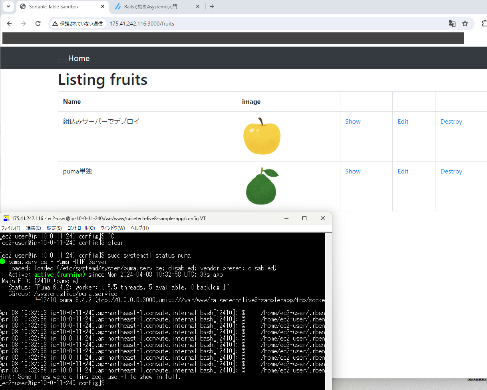
- Nginxの単体起動確認<br>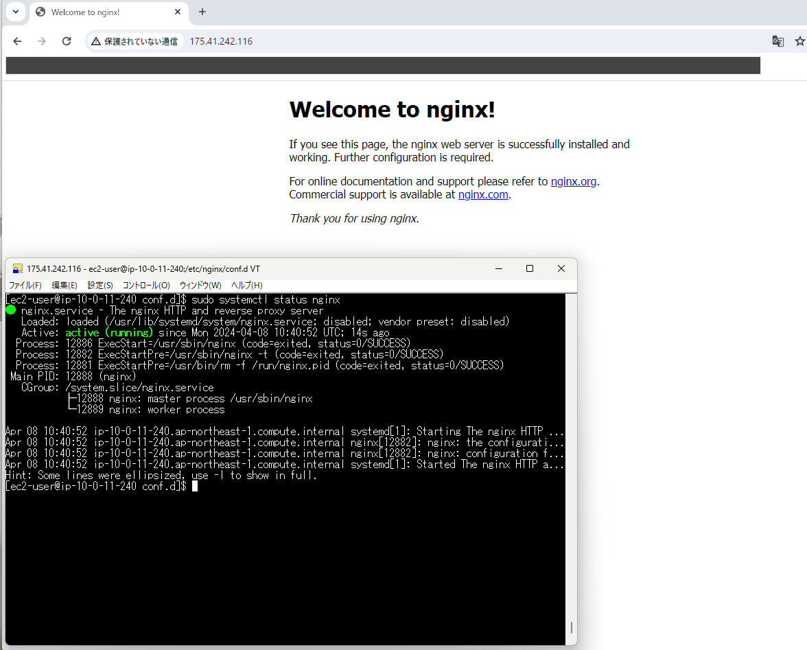
- Nginxとpumaを組み合わせてデプロイ<br>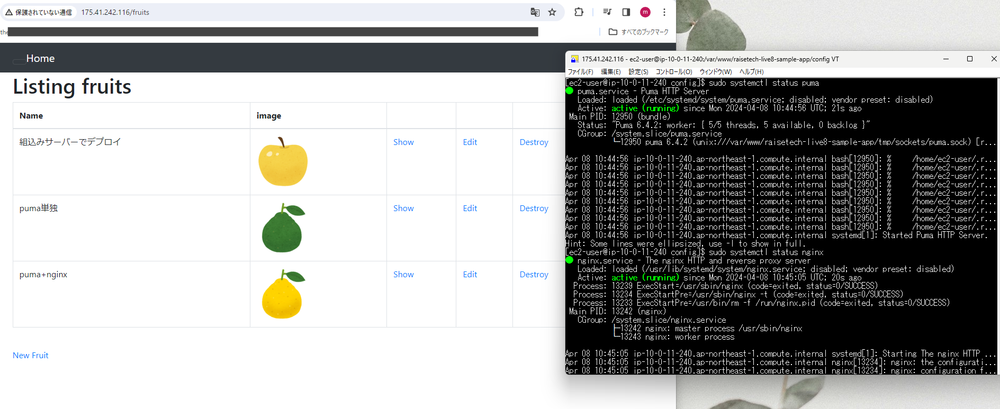

---

## ELB（ALB）の追加

- ALBの作成<br>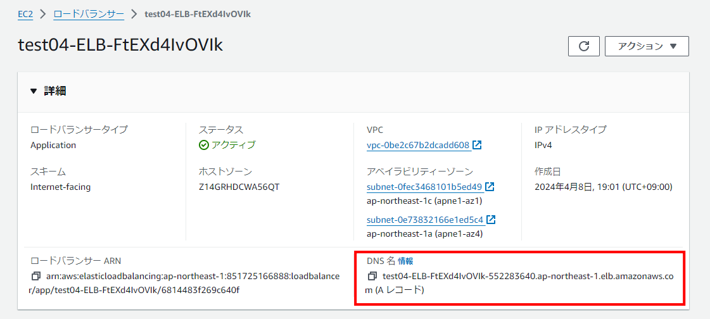
- ターゲットグループのヘルスステータス<br>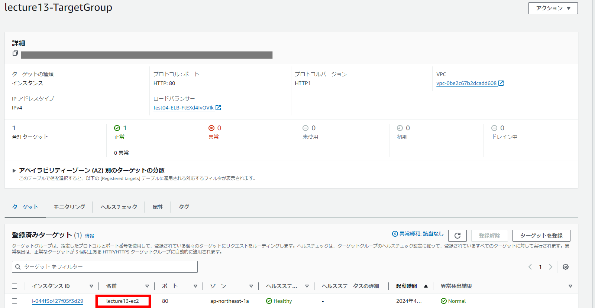
- ALBのDNS名でアクセスし動作確認完了<br>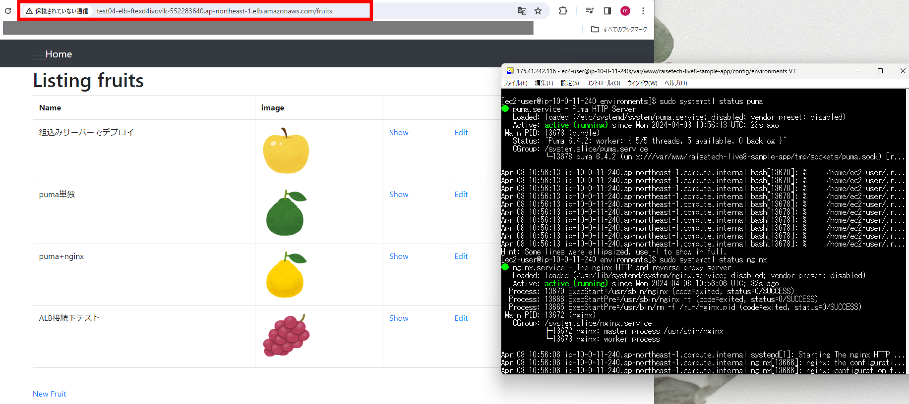

---

## S3の追加（サンプルアプリの画像保存先として使用）

- S3の作成<br>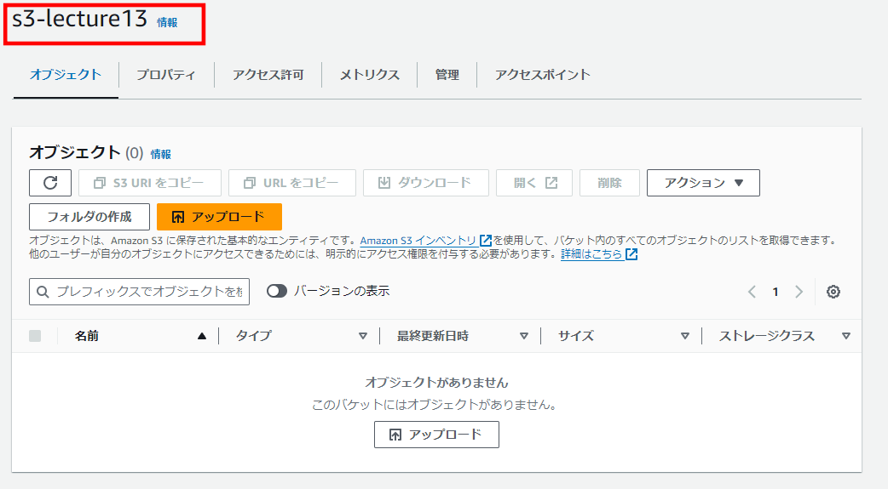
- EC2にS3への接続を許可するIAMロール追加<br>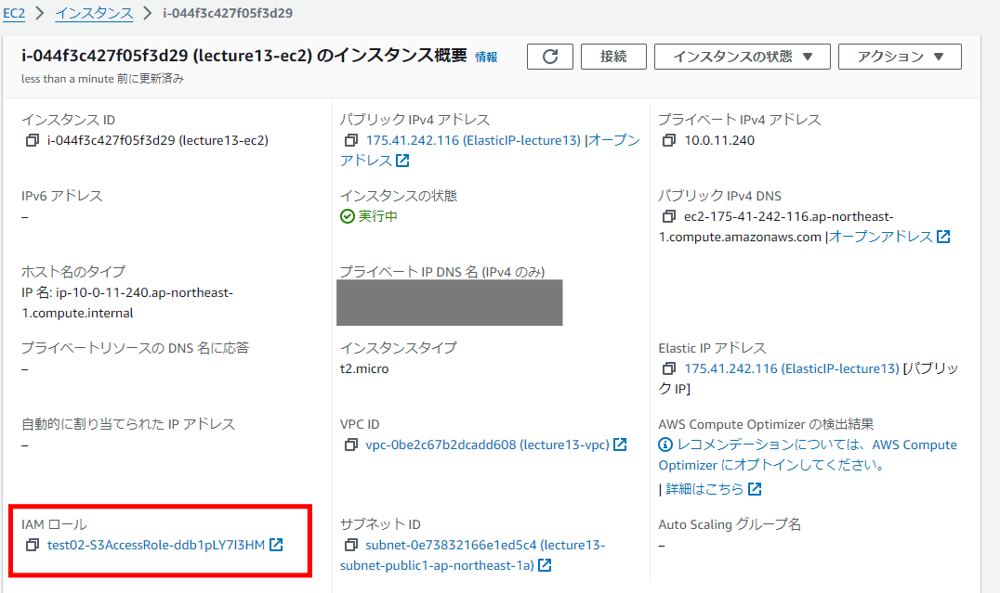
- IAMロールの内容（AmazonS3FullAcces付与）<br>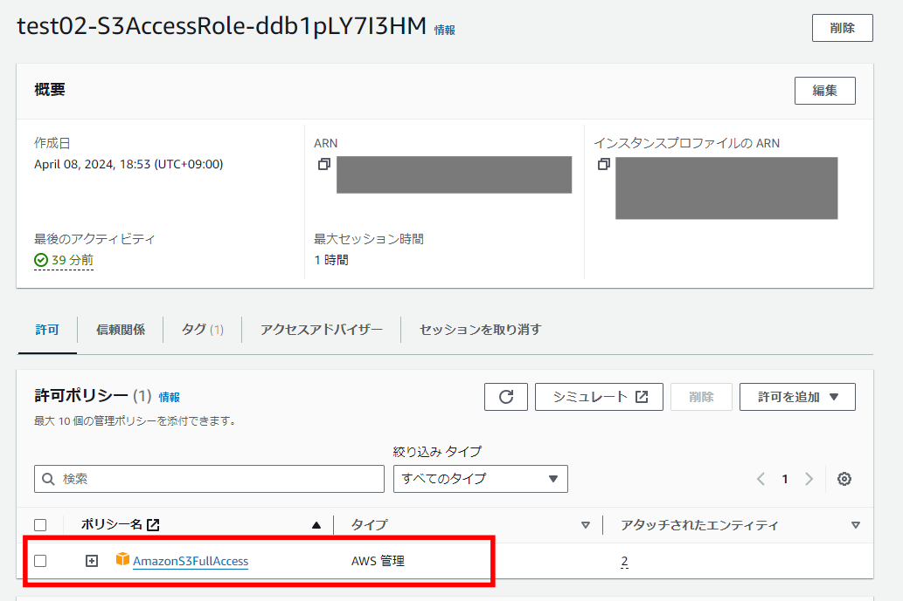
- S3に画像を保存<br>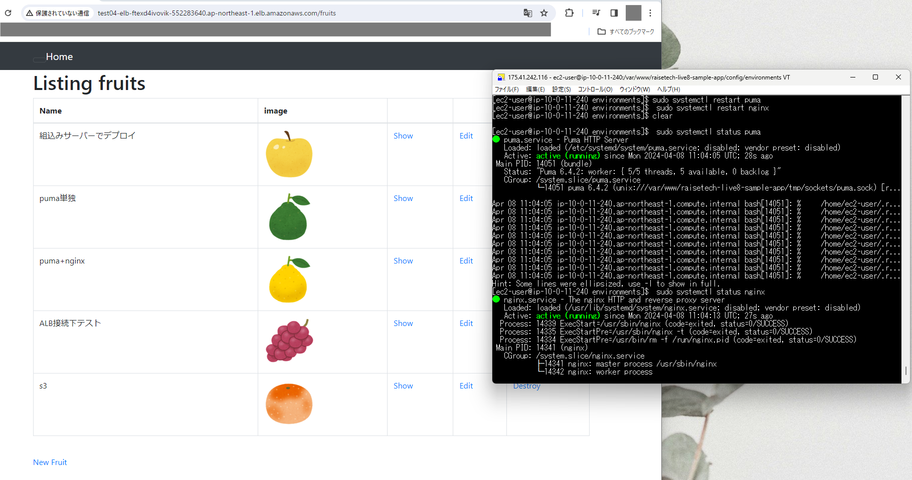
- S3内に画像がある事を確認<br>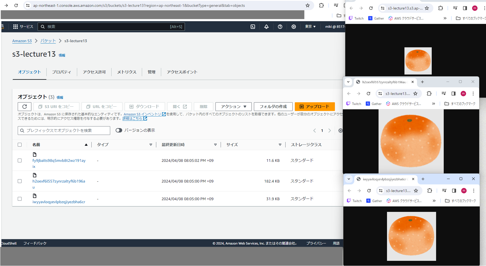

---

## 構成図の作成

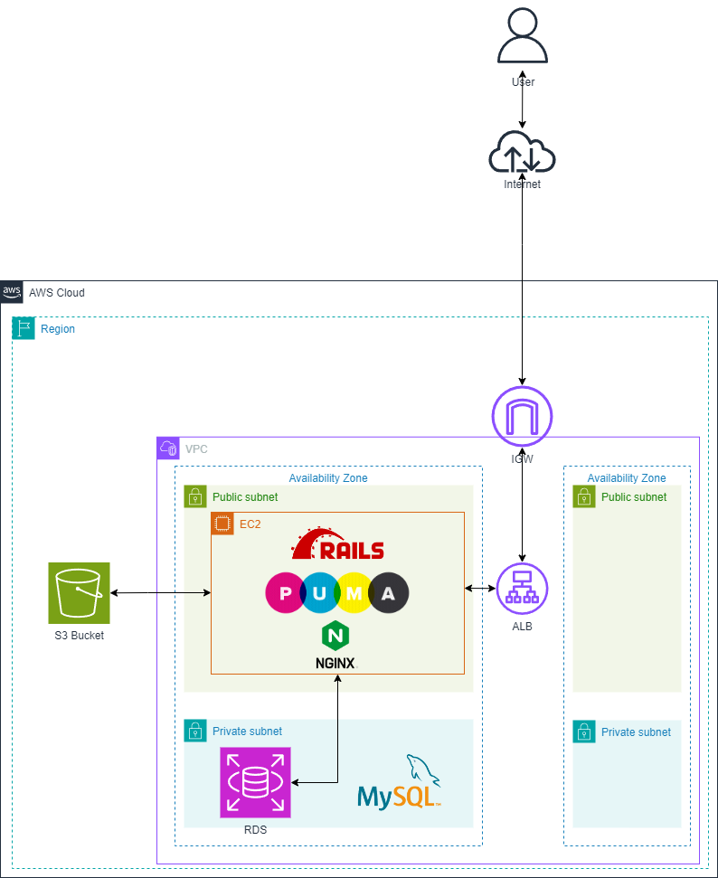

---

## Railsアプリケーションの動作環境

ruby

```bash
3.2.3
```

Bundler

```bash
2.3.14
```

Rails

```bash
7.1.3.2
```

Node

```bash
v17.9.1
```

yarn

```bash
1.22.19
```


---

## 課題を終えた感想

Railsのサンプルアプリケーションの仕様が変更になった事もあり、新しいサンプルアプリケーションを使用して再度第5回の課題を行った。
以前、旧サンプルアプリケーションで本課題を実行した際はエラーのログをチェックするというよりGoogle検索で似た事例がないか確認して問題を解決するという行き当たりばったりな方法で課題を進めていたが、今回はログでエラーの内容を確認して対応するという本来あるべき手順を何度も重ねることで課題を達成できた。今後もエラーの読み込みをしっかり行うようにしたい。
