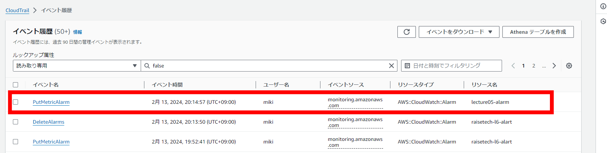
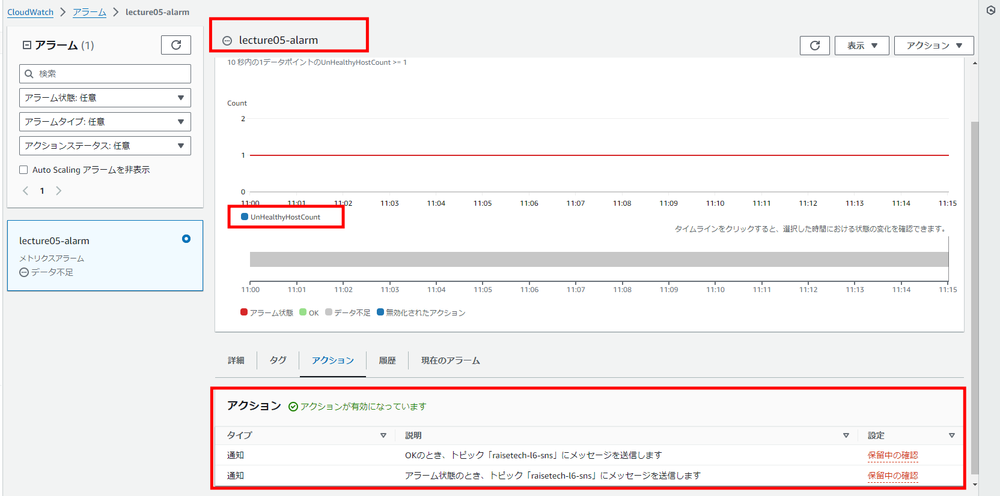
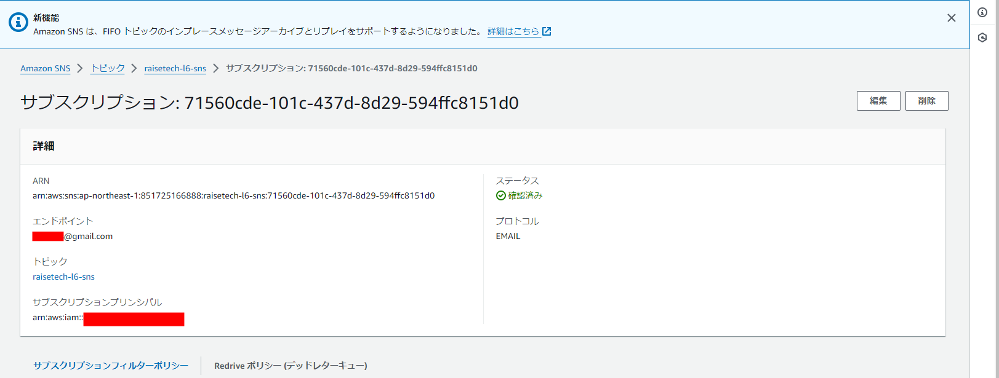
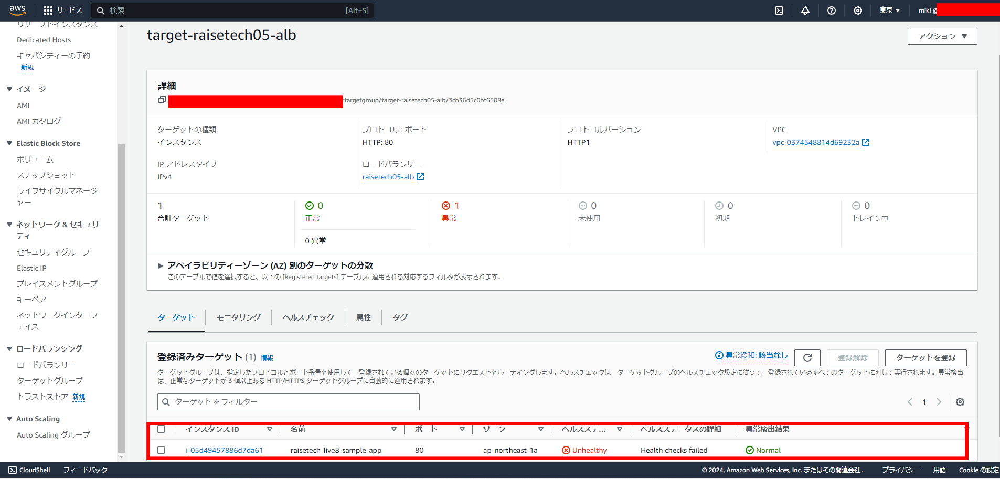
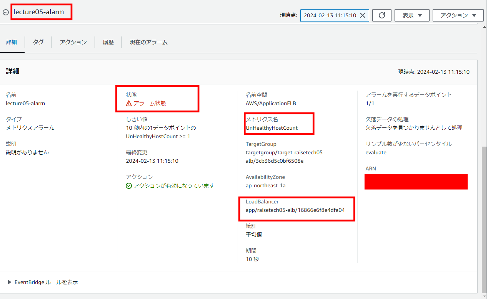
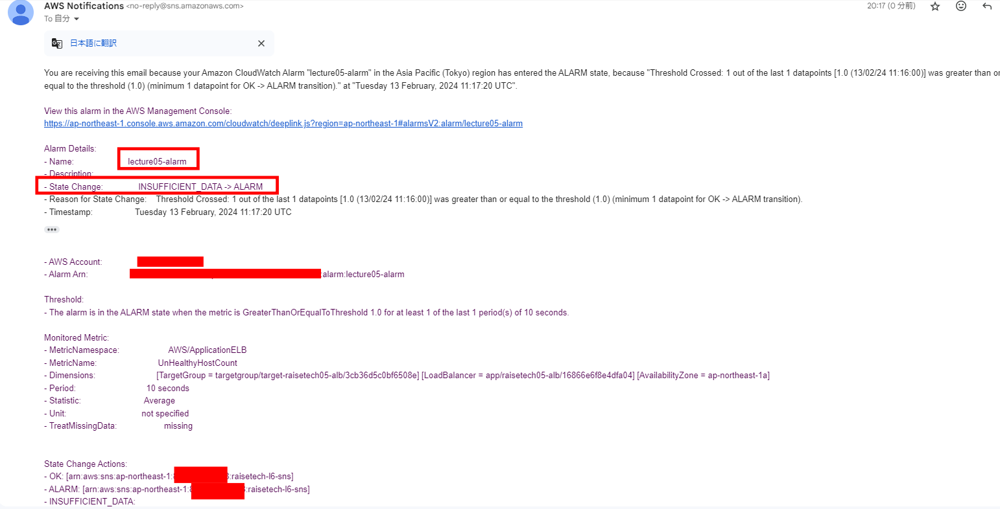
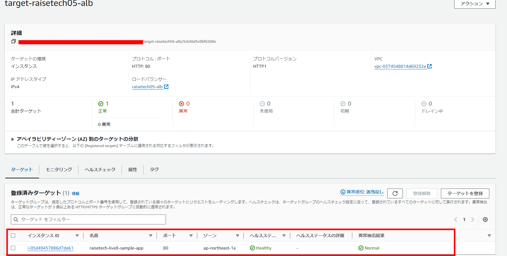
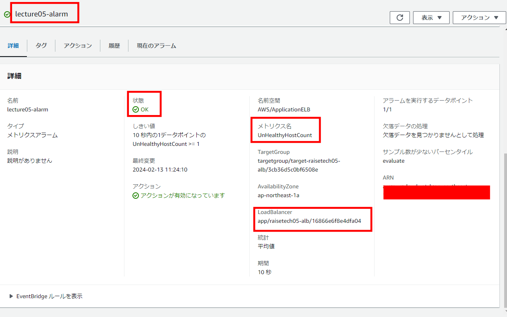
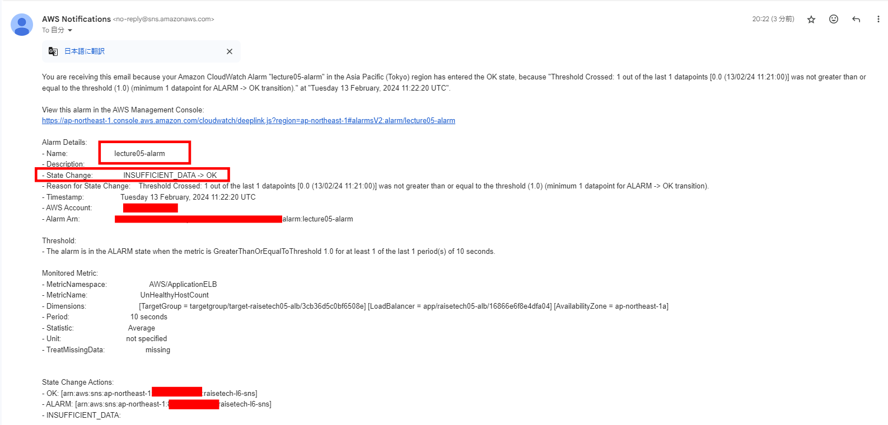
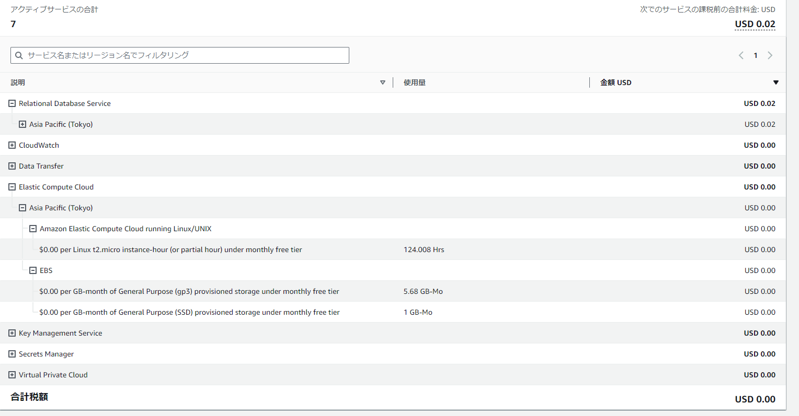

# 第6回課題

- CloudTrail のイベントと含まれる内容3点
- CloudWatchアラームでALBのアラームを設定
- AWS利用料の見積
- 現在の利用料

---

## CloudTrail のイベント名と含まれる内容3点

- イベント画像 
  - イベント名：PutMetricAlarm
  - ユーザー名
  - イベント時間
  - AWSアクセスキー

---

## CloudWatchアラームでALBのアラームを設定

- アラームの設定（アラーム状態、OK状態の両方を通知） 
- AmazonSNSの設定 
- Nginx+unicorn停止状態（アラーム状態）
  - ロードバランサーがunhealthy 
  - アラームがアラーム状態になる 
  - アラームのメールが届く 
- Nginx+unicornka稼働状態（OK状態）
  - ロードバランサーがhealthy 
  - アラームがOK状態になる 
  - OKのメールが届く 

---

## AWS利用料の見積

[見積共有リンク](https://calculator.aws/#/estimate?id=c39fc52d14ab9e82d42c36dc84853e5b25620bac "見積共有リンク")

---

## 現在の利用料（先月の請求情報からEC2の料金がいくらか確認する）

EC2の利用料

---

## 以下、学習記録として記述しました。課題とされた内容ではありません

### 今回の課題でつまったポイント

- CloudWatchアラームの設定をunhealthyhostcountではなく、healthyhostcountを誤って選択してしまい、誤りに気付くまで時間がかかった。早く設定内容の確認をすべきだった。

---

以上です。
