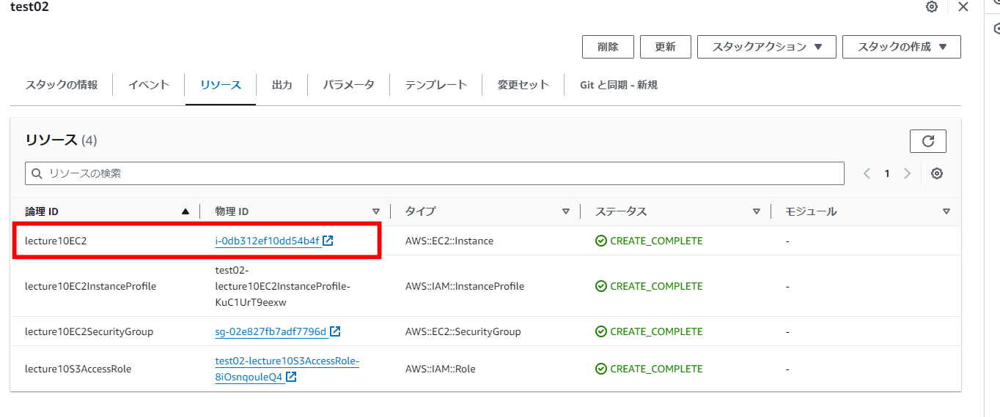
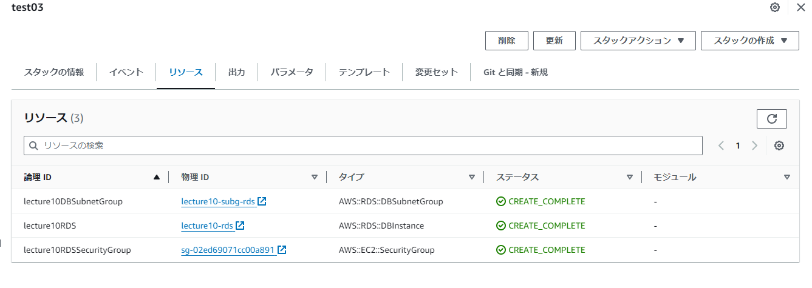
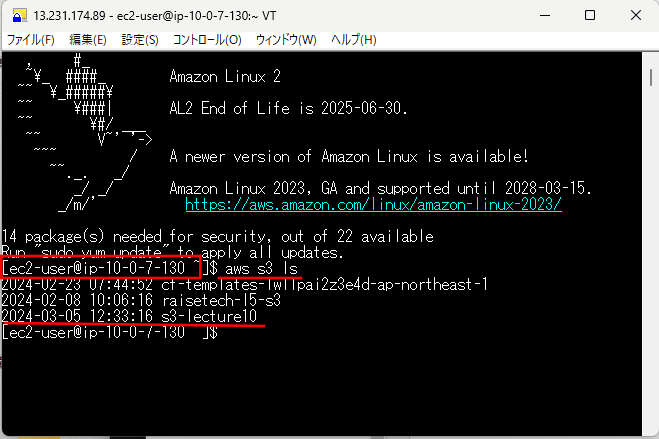

# 第10回課題

## CloudFormationで現在までに作った環境をコード化する。コード化ができたら実行してみて、環境が自動で作られることを確認する
  
- 「CloudFormation」フォルダ内にテンプレートがあります。下記のようにスタックを分割しました。カッコ内が各ファイル名です。

1. VPC、Subnet、InternetGateway、RouteTable（test01_vpc）
2. EC2インスタンス関連（test02_ec2）
3. RDS関連（test03_rds）
4. ELB関連（test04_elb）
5. S3関連（test05_s3）

詳細の確認が必要な場合は「CloudFormation」フォルダ内にデータがありますのでご確認ください。

---

### CloudFormationで現在までに作った環境をコード化する

- VPC、Subnet、InternetGateway、RouteTable（test01_vpc） 
- EC2インスタンス関連（test02_ec2） 
- RDS関連（test03_rds） 
- ELB関連（test04_elb） 
- S3関連（test05_s3） 

---

### 作成したEC2にTeraTermで接続確認

- 作成したEC2のIPアドレス 
- 接続確認画面（lsコマンドでS3への接続も確認） 

---

### 以下、学習記録として記述しました。課題とされた内容ではありません

#### 今回の課題で学んだこと、これからの課題

- コード化することでこれまで作成した環境だけでなくIGWなどウィザードによって自動で作成されていた部分の設定や構造を理解することができた。
- 各パラメータの名称や役割についての理解が浅い為いろいろなパターンの環境を作成し理解を深めていきたい。
