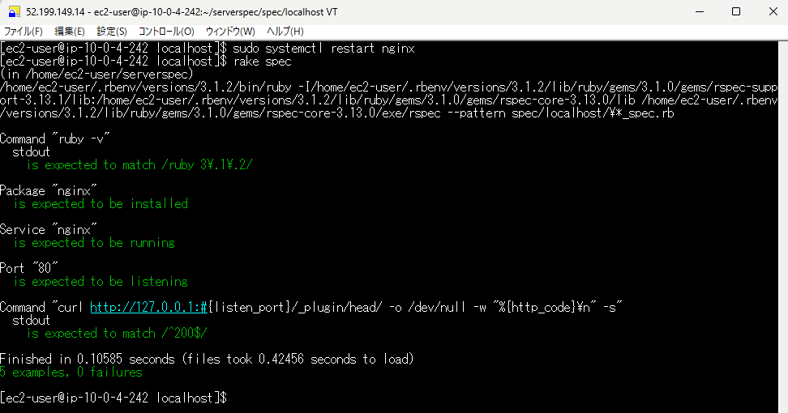
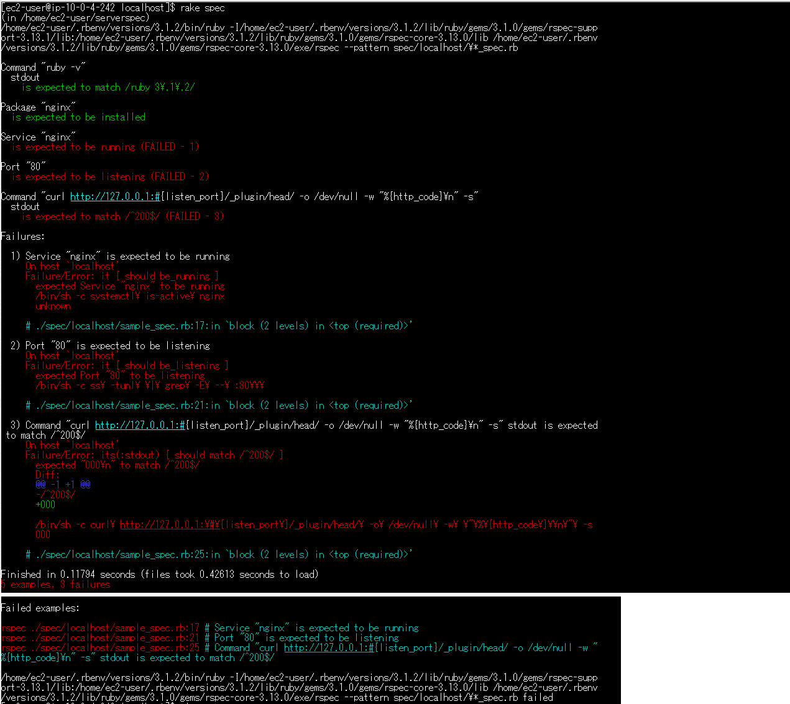

# 第11回課題

- ServerSpec のテストが成功することを追加課題とします。
  - サンプルを提供しますので、授業を参考にカスタマイズしてみてください。
  - テスト定義には決まった答えはないので、自由な発想で色々試してみましょう。

第10回課題で作成したcloudformationのテンプレートでEC2を作成し、環境構築を行ってserverspecのテストを実行した。

---

## serverspecのインストール

```bash
#serverspec用のディレクトリを作成

$ mkdir serverspec

#Gemfileを作成

$ bundle init

$ vi Gemfile

#Gemfileに「gem 'serverspec'」を追記

$ bundle

$ serverspec-init
```

---

## テストのセットアップ

```bash
Select OS type:

  1) UN*X
  2) Windows

Select number: 1

Select a backend type:

  1) SSH
  2) Exec (local)

Select number: 2

 #どのようなテストをするのかが記載されたファイルが入っているディレクトリ
 + spec/
 #このディレクトリ以下で *_spec.rbというファイル名のテストが実行される
 + spec/localhost/
 #テスト設定を記述したファイル
 + spec/localhost/sample_spec.rb
 #テストの設定を記述するファイル
 + spec/spec_helper.rb
 #rakeコマンドを使ってテストを実行するための設定ファイル
 + Rakefile 
```

- テストファイルの基本的な構成内容

```bash
describe ＜リソースタイプ＞(＜テスト対象＞) do
  ＜テスト条件＞
  ：
  ：
end
```

- 課題サンプルから指定されたテストの記述をコピーし、テストを2個追加

```bash
# rails_helperの読み込み
require 'spec_helper'

#80番ポートを指定
listen_port = 80

#追加テスト01（rubyが指定のバージョンでインストールされているか確認）
describe command('ruby -v') do
  its(:stdout) { should match /ruby 3\.1\.2/ }
end

#Nginxがインストールされているか確認
describe package('nginx') do
  it { should be_installed }
end

#追加テスト02（Nginxが起動しているか確認）
describe service('nginx') do
  it { should be_running }
end

#指定されたポートをlistenしているか確認
describe port(listen_port) do
  it { should be_listening }
end

#curlでHTTPアクセスして200 OKが返ってくるか確認する
describe command('curl http://127.0.0.1:#{listen_port}/_plugin/head/ -o /dev/null -w "%{http_code}\n" -s') do
  its(:stdout) { should match /^200$/ }
end
```

---

## テストを実行

- テスト成功画面<br>
- Nginxを停止してテスト失敗を確認<br>

---

## 以下、学習記録として記述しました。課題とされた内容ではありません

### 第5回課題ではrvmを利用したので今回はrbenvでrubyのインストールに挑戦

```bash
#パッケージをアップデート
$ sudo yum update -y

#gitをインストール
$ sudo yum install git

#gccコンパイラをインストール
$ sudo yum -y install gcc-c++ make patch git curl zlib-devel openssl-devel ImageMagick-devel readline-devel libcurl-devel libffi-devel libicu-devel libxml2-devel libxslt-devel

#rbenvをclone
$ git clone https://github.com/sstephenson/rbenv.git ~/.rbenv

# PATH に追加
$ echo 'export PATH="$HOME/.rbenv/bin:$PATH"' >> ~/.bash_profile
$ echo 'eval "$(rbenv init -)"' >> ~/.bash_profile

#再読み込み
$ exec $SHELL -l

#ruby-buildをインストール
$ git clone https://github.com/sstephenson/ruby-build.git ~/.rbenv/plugins/ruby-build

#パッケージをインストール
$ sudo yum install -y gcc-6 patch bzip2 openssl-devel libyaml-devel libffi-devel readline-devel zlib-devel gdbm-devel ncurses-devel

#第5回課題と同じバージョンを指定してrubyをインストール
$ rbenv install 3.1.2

#railsをインストール
$ gem install rails -v 7.0.4

#エラー発生
The gem command exists in these Ruby versions:3.1.2

#下記コマンドでエラー解消(rehashで解決しなかったので使用バージョンを指定すると解決した)
$ rbenv rehash
$ exec $SHELL -l
$ rbenv global 3.1.2
$ exec $SHELL -l
```

```bash
#nvmをインストール
$ curl -o- https://raw.githubusercontent.com/nvm-sh/nvm/v0.39.5/install.sh | bash

$ source ~/.bash_profile

$ nvm install 17.9.1

#yarnをインストール
$ npm install --global yarn

#bundlerをインストール
$ gem install bundler:2.3.14
```

```bash
#Nginxのインストール
$ sudo amazon-linux-extras install -y nginx1
```

---

### 今回の課題で学んだこと、これからの課題

- Serverspecでどのようなテストを行えるか知ることができた。
- 他のリソースを追加していろいろなテストを試してみたい。
