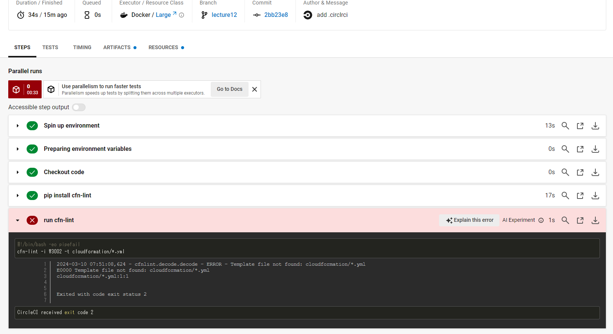
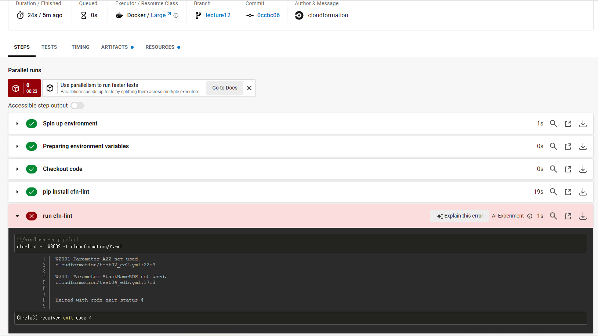
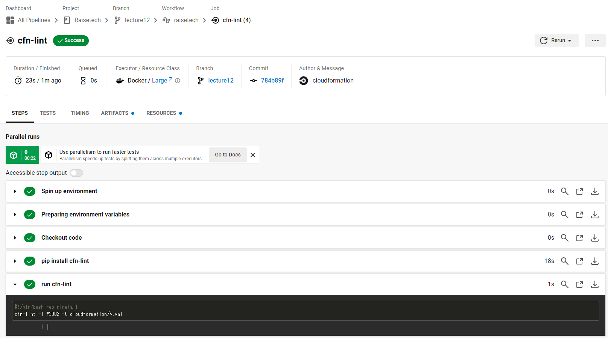

# 第12回課題

- 課題：CircleCI のサンプルコンフィグを提供しますので、これが正しく動作するようにリポジトリに組み込んでください。

```bash
#サンプルコンフィグ（「cloudformation」ディレクトリ内の*.ymlファイルをcfn-lintでチェック）

#CircleCIのバージョンを指定
version: 2.1
orbs:
  python: circleci/python@2.0.3
#一つ以上のjobを設定する。job名はbuildでなければならない
jobs:
  cfn-lint:
    executor: python/default
    steps:
      - checkout
      - run: pip install cfn-lint
      - run:
          name: run cfn-lint
          command: |
            cfn-lint -i W3002 -t cloudformation/*.yml

#実行順序を規定
workflows:
  raisetech:
    jobs:
      - cfn-lint
```

---

## CircleCIでプロジェクトを作成しテストを実行

1. Template file not found: cloudformation/*.ymlというエラーが検出<br>
⇒ディレクトリ名が「CloudFormation」になっていたので全て小文字に変更して解消<br>

2. 新たに2件のエラーが検出<br>
⇒Parametersに使用されていない項目が2件あったので削除<br>
3. すべてのエラーが解消された<br>

---

## 以下、学習記録として記述しました。課題とされた内容ではありません

### 今回の課題で学んだこと、これからの課題

- 今回はディレクトリ名を大文字から小文字に変更する必要があったが、Gitはデフォルトでファイル名の大文字・小文字の変更を検知しない設定になっているらしい。変更が差分として反映されないのでしばらく戸惑った。

```bash
#下記コマンドで大文字・小文字を検知するように変更した
$ git config core.ignorecase false
```

- 今後はlineter以外のテストも試してみたい。
