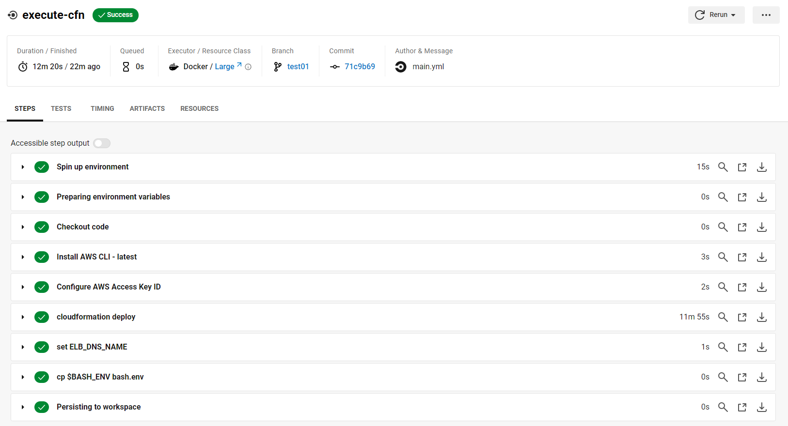
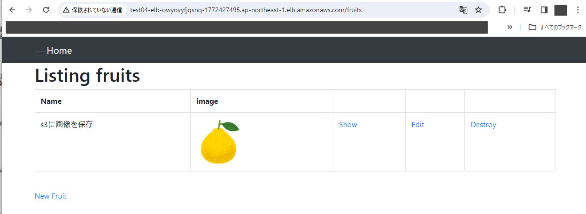
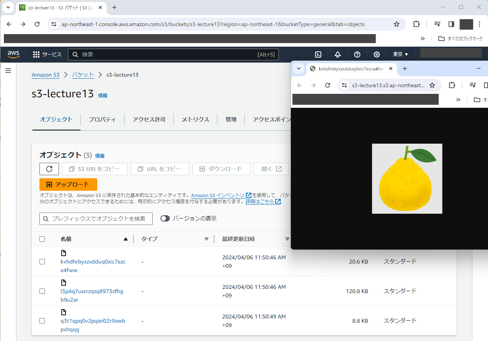

# 第13回課題

- CircleCI のサンプルに ServerSpec や Ansible の処理を追加してください。
- Ansible はいきなりやりたいことを実装するのではなく、最低限の「必ず成功する Playbook」を用意して徐々に仕事を追加しましょう。

---

## 実施概要

Raisetechより提供されたCRUD 処理が出来るRailsアプリケーションを稼働させるインフラストラクチャを自動構築する。  
今回は以前提出した課題への影響を避けるため別のリポジトリを作成して課題を実行した。

[第13回課題で利用したリポジトリ](https://github.com/m-iws/circleci)

使用ツールは下記の通り。

**CircleCI**  

- CloudFormationの実行  
- Ansibleの実行
- ServerSpecの実行

**CloudFormation** 

- VPC、EC2、RDS、ELB、S3を作成（詳細は構成図に記載）

**Ansible**

- Railsアプリケーション用の環境構築を行う

**ServerSpec**

- Railsアプリケーションのレスポンスを確認

---

## 事前設定
必要な環境変数はCircleCIの `Environment Variables` に登録しておく。 

---

## 手順

1. CloudFormationの設定
2. Ansibleの設定
3. ServerSpecの設定
4. Circleciの実行結果を確認
5. Railsアプリケーションの動作確認

---

### CloudFormationの設定

[CloudFormationのテンプレート](lecture13/cloudformation/)は第10回課題で作成したデータを一部修正して使用（利便性向上のためElasticIPをEC2に割り当てる設定へ修正）。 
AWS CLIを用いてCloudFormationを実行する設定を[config.yml](lecture13/.circleci/config.yml)に追加。  

---

### Ansibleの設定
[config.yml](lecture13/.circleci/config.yml)にAnsibleのplaybook.ymlを実行する設定を追加。（[Ansibleの設定ファイル](lecture13/ansible)）

---

### ServerSpecの設定

第11回で作成したServerSpecのテストスクリプトを実行する設定を[config.yml](lecture13/.circleci/config.yml)に追加。

---

### Circleciの実行結果を確認

1. 結果一覧 
2. cfn-lintの結果 
3. execute-cfnの結果 
4. execute-ansibleの結果 
5. execute-serverspecの結果 

---

### Railsアプリケーションの動作確認

1. ALBのDNS名でアクセスし、画像の保存が成功することを確認 
2. S3へ画像が保存出来ていることを確認 

---

## 苦労したところ

- Railsアプリケーション更新への対応 
課題の進行途中でRaisetechから提供されているサンプルアプリケーションが更新され`unicorn+nginx`の構成から`puma+nginx`の構成での起動へ仕様変更されたので環境構築方法の確認からやり直す事になった。 
一つ一つエラーログを見ながら対応したが、Railsアプリケーションへの理解が足りていないことを実感した。

---

## 今後への課題・やってみたい事
SAAの資格取得が優先されるが今後の課題を記載した。
- Railsの学習をし理解を深めたい
- アプリのリクエストがhttp通信でセキュリティ上問題があるためhttps通信へリダイレクトするよう変更したい
